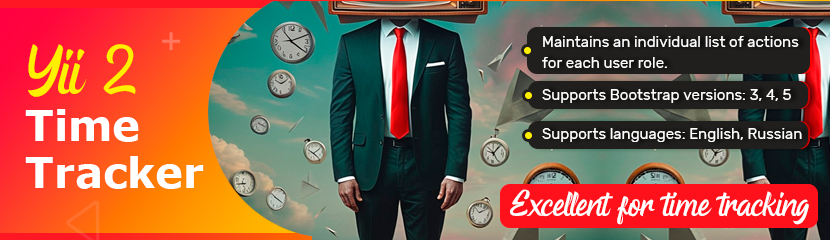

# Yii2 Time tracker

Yii 2 module for time tracking. 



[](https://packagist.org/packages/zakharov-andrew/yii2-time-tracker)
[](https://packagist.org/packages/zakharov-andrew/yii2-time-tracker)
[](http://www.yiiframework.com/)

The time tracking module for the Yii2 framework is a comprehensive solution for monitoring time spent on various tasks within projects. It allows users to easily start, stop, and record time intervals for specific tasks, as well as provides detailed reports on time spent.

- Maintains an individual list of actions for each user role.
- Supports Bootstrap versions: 3, 4, 5
- Supports languages: English, Russian

## 🚀 Installation

The preferred way to install this extension is through [composer](http://getcomposer.org/download/).

Either run

```
$ composer require zakharov-andrew/yii2-time-tracker
```
or add

```
"zakharov-andrew/yii2-time-tracker": "*"
```

to the ```require``` section of your ```composer.json``` file.

Subsequently, run

```
./yii migrate/up --migrationPath=@vendor/zakharov-andrew/yii2-time-tracker/migrations
```

in order to create the settings table in your database.

Or add to console config

```php
return [
    // ...
    'controllerMap' => [
        // ...
        'migrate' => [
            'class' => 'yii\console\controllers\MigrateController',
            'migrationPath' => [
                '@console/migrations', // Default migration folder
                '@vendor/zakharov-andrew/yii2-time-tracker/src/migrations'
            ]
        ]
        // ...
    ]
    // ...
];
```

## 🛠 Usage

Add this to your main configuration's modules array

```php
    'modules' => [
        'timetracker' => [
            'class' => 'ZakharovAndrew\TimeTracker\Module',
            'bootstrapVersion' => 5, // if use bootstrap 5
            'showTitle' => true, // display H1 headings (default - true)
        ],
        // ...
    ],
```

## 👥 Contributing

Contributions are welcome! Please feel free to submit a Pull Request.

1. Fork the repository
2. Create your feature branch (`git checkout -b feature/amazing-feature`)
3. Commit your changes (`git commit -m 'Add some amazing feature'`)
4. Push to the branch (`git push origin feature/amazing-feature`)
5. Open a Pull Request

## 📄 License

**yii2-time-tracker** it is available under a MIT License. Detailed information can be found in the `LICENSE.md`.
